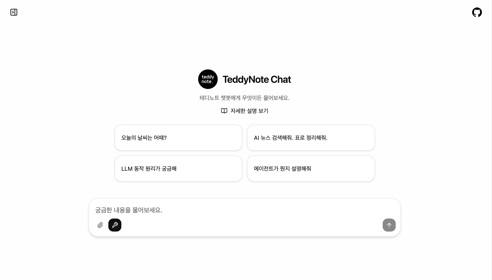

# Agent Chat UI



LangGraph 에이전트를 위한 Next.js 기반 채팅 인터페이스입니다. YAML 기반 설정을 통한 높은 커스터마이징 옵션을 제공합니다.

원본 프로젝트인 [https://github.com/langchain-ai/agent-chat-ui](https://github.com/langchain-ai/agent-chat-ui) 을 참고하여 수정한 프로젝트 입니다.

## 개요

Agent Chat UI는 Next.js 15로 구축된 프로덕션 수준의 채팅 인터페이스로, LangGraph 서버와의 원활한 상호작용을 지원합니다. YAML 기반 설정을 통한 UI 커스터마이징, 파일 업로드, 대화 기록 관리, 실시간 스트리밍 응답 등의 기능을 제공합니다.

## 요구사항

### 프론트엔드 (agent-chat-ui)
- Node.js 18.x 이상
- pnpm 10.x (패키지 매니저)

### 백엔드 (react-agent)
- Python 3.11 이상
- uv (Python 패키지 매니저)
- OpenAI API 키 (또는 다른 LLM API 키)

## 설치 방법

### 1. 저장소 클론

```bash
git clone https://github.com/teddylee777/agent-chat-ui.git
cd agent-chat-ui
```

### 2. 의존성 설치

```bash
pnpm install
```

### 3. LangGraph 백엔드 서버 설정

이 채팅 UI는 LangGraph 백엔드 서버와 연결하여 동작합니다. 로컬 개발 환경에서 테스트하려면 먼저 백엔드 서버를 설정해야 합니다.

#### 백엔드 서버 설치

```bash
# 백엔드 저장소 클론
git clone https://github.com/teddylee777/react-agent
cd react-agent

# 환경 변수 설정
cp .env.example .env
# .env 파일을 편집하여 필요한 API 키 설정 (OPENAI_API_KEY 등)

# LangGraph 개발 서버 실행
uv run langgraph dev
```

백엔드 서버가 `http://localhost:2024`에서 실행됩니다.

#### 프론트엔드 환경 변수 설정

agent-chat-ui 디렉토리로 돌아와서 `.env` 파일을 생성합니다:

```bash
cd ../agent-chat-ui
cp .env.example .env
```

로컬 개발을 위한 환경 변수를 설정합니다:

```env
# 필수: LangGraph API 엔드포인트 (로컬 개발용)
NEXT_PUBLIC_API_URL=http://localhost:2024

# 필수: Assistant/Graph ID
NEXT_PUBLIC_ASSISTANT_ID=agent

# 선택: 프로덕션 배포용
LANGGRAPH_API_URL=https://your-deployment.langgraph.app
LANGSMITH_API_KEY=lsv2_...
```

## 실행 방법

### 개발 모드

**1단계: LangGraph 백엔드 서버 실행**

먼저 백엔드 서버를 실행합니다 (react-agent 디렉토리에서):

```bash
cd react-agent
uv run langgraph dev
```

백엔드 서버가 `http://localhost:2024`에서 실행됩니다.

**2단계: 프론트엔드 개발 서버 실행**

새 터미널 창을 열어 프론트엔드 서버를 시작합니다:

```bash
cd agent-chat-ui
pnpm dev
```

프론트엔드 애플리케이션이 `http://localhost:3000`에서 실행됩니다.

이제 브라우저에서 `http://localhost:3000`에 접속하면 LangGraph 백엔드와 연결된 채팅 인터페이스를 사용할 수 있습니다.

### 프로덕션 빌드

프로덕션 서버를 빌드하고 시작합니다:

```bash
pnpm build
pnpm start
```

### 기타 명령어

```bash
# 린터 실행
pnpm lint

# 린팅 문제 자동 수정
pnpm lint:fix

# Prettier로 코드 포맷팅
pnpm format

# 코드 포맷 검사
pnpm format:check
```

## 설정

### 설정 파일

애플리케이션은 `public/settings.yaml` 파일을 통해 설정됩니다. 이 파일은 브랜딩부터 UI 동작까지 채팅 인터페이스의 모든 측면을 제어합니다.

### 설정 옵션

#### Branding 섹션

| 옵션 | 타입 | 설명 | 예시 |
|------|------|------|------|
| `appName` | string | 헤더에 표시되는 애플리케이션 이름 | `"테디노트 챗"` |
| `logoPath` | string | public 디렉토리 내 로고 이미지 경로 | `"/logo.png"` |
| `logoWidth` | number | 로고 너비(픽셀) | `28` |
| `logoHeight` | number | 로고 높이(픽셀) | `28` |
| `description` | string | 랜딩 페이지에 표시되는 부제목 | `"무엇이든 물어보세요"` |
| `chatOpeners` | string[] | 대화 시작 프롬프트 (최대 4개) | `["오늘 날씨는?"]` |
| `fullDescription` | string | 상세 가이드 마크다운 파일 경로 | `"/full-description.md"` |

#### Buttons 섹션

| 옵션 | 타입 | 설명 | 기본값 |
|------|------|------|--------|
| `enableFileUpload` | boolean | 파일 업로드 버튼 표시/숨김 | `true` |
| `chatInputPlaceholder` | string | 입력 필드 플레이스홀더 텍스트 | `"메시지를 입력하세요..."` |

#### Threads 섹션

| 옵션 | 타입 | 설명 | 기본값 |
|------|------|------|--------|
| `showHistory` | boolean | 대화 기록 패널 활성화 | `false` |
| `enableDeletion` | boolean | 대화 삭제 기능 허용 | `true` |
| `enableTitleEdit` | boolean | 대화 제목 변경 기능 허용 | `true` |
| `autoGenerateTitles` | boolean | 대화 제목 자동 생성 | `true` |
| `sidebarOpenByDefault` | boolean | 초기 로드 시 사이드바 열기 | `true` |

#### Theme 섹션

| 옵션 | 타입 | 값 | 기본값 |
|------|------|-----|--------|
| `fontFamily` | string | `"sans"`, `"serif"`, `"mono"` | `"serif"` |
| `fontSize` | string | `"small"`, `"medium"`, `"large"` | `"large"` |
| `colorScheme` | string | `"light"`, `"dark"`, `"auto"` | `"light"` |

#### UI 섹션

| 옵션 | 타입 | 설명 | 기본값 |
|------|------|------|--------|
| `autoCollapseToolCalls` | boolean | 완료 후 도구 호출 세부사항 자동 접기 | `true` |
| `chatWidth` | string | `"default"` (768px) 또는 `"wide"` (1280px) | `"wide"` |

### 설정 예시

```yaml
branding:
  appName: "테디노트 챗"
  logoPath: "/logo.png"
  logoWidth: 28
  logoHeight: 28
  description: "AI와 기술에 대해 무엇이든 물어보세요."
  chatOpeners:
    - "오늘의 날씨는 어때?"
    - "AI 뉴스 검색해줘. 표로 정리해줘."
    - "LLM 동작 원리가 궁금해."
    - "에이전트가 뭐야?"
  fullDescription: "/full-description.md"

buttons:
  enableFileUpload: true
  chatInputPlaceholder: "무엇이든 물어보세요..."

threads:
  showHistory: false
  enableDeletion: true
  enableTitleEdit: true
  autoGenerateTitles: true
  sidebarOpenByDefault: true

theme:
  fontFamily: "serif"
  fontSize: "large"
  colorScheme: "light"

ui:
  autoCollapseToolCalls: true
  chatWidth: "wide"
```

## 사용자 가이드 커스터마이징

전체 사용자 가이드는 `public/full-description.md`에 위치합니다. 이 마크다운 파일은 사용자가 랜딩 페이지에서 "자세한 설명 보기" 버튼을 클릭할 때 표시됩니다.

### 가이드 업데이트 방법

1. `public/full-description.md` 파일을 편집합니다
2. 표준 마크다운 문법을 사용합니다
3. 파일을 저장하면 변경사항이 즉시 반영됩니다 (재빌드 불필요)

### 가이드 구조 권장사항

- **시작하기**: 기본 사용 방법
- **주요 기능**: 상세한 기능 설명
- **설정**: 최종 사용자를 위한 설정 옵션
- **팁과 요령**: 고급 사용 패턴
- **문제 해결**: 일반적인 문제 및 해결 방법

## 파일 업로드 지원

애플리케이션은 다음 파일 형식을 지원합니다:

- **이미지**: JPEG, PNG, GIF, WebP
- **문서**: PDF

파일 업로드 방법:
- 채팅 입력창의 클립 아이콘 클릭
- 파일을 채팅 인터페이스로 드래그 앤 드롭
- 클립보드에서 이미지 붙여넣기

## 프로덕션 배포

### 프로덕션 환경 변수

```env
# Public 변수 (클라이언트에 노출)
NEXT_PUBLIC_ASSISTANT_ID=agent
NEXT_PUBLIC_API_URL=https://your-site.com/api

# Private 변수 (서버 측 전용)
LANGGRAPH_API_URL=https://your-agent.langgraph.app
LANGSMITH_API_KEY=lsv2_...
```

### 배포 플랫폼

애플리케이션은 다음 플랫폼에 배포할 수 있습니다:

- **Vercel**: Next.js 애플리케이션에 권장
- **Netlify**: Next.js 기능 완벽 지원
- **Docker**: 컨테이너화된 배포 옵션
- **전통적인 호스팅**: 모든 Node.js 호스팅 제공업체

### 프로덕션 빌드

```bash
pnpm build
```

이 명령은 `.next` 디렉토리에 최적화된 프로덕션 빌드를 생성합니다.

## 아키텍처

### 기술 스택

- **프레임워크**: Next.js 15.x (React 19)
- **스타일링**: Tailwind CSS 4.x
- **상태 관리**: React Hooks + nuqs (URL 상태)
- **UI 컴포넌트**: Radix UI primitives
- **마크다운**: react-markdown (remark/rehype 플러그인)
- **코드 하이라이팅**: react-syntax-highlighter
- **수식 렌더링**: KaTeX
- **API 통합**: LangGraph SDK

### 주요 의존성

- `@langchain/langgraph-sdk`: LangGraph 클라이언트 라이브러리
- `framer-motion`: 애니메이션 라이브러리
- `next-themes`: 테마 관리
- `sonner`: 토스트 알림
- `js-yaml`: YAML 설정 파싱

## 고급 기능

### Artifact 렌더링

채팅 인터페이스는 사이드 패널에서 artifact (코드, 문서, 시각화)를 렌더링할 수 있습니다. Artifact는 LangGraph 서버 응답 메타데이터를 통해 관리됩니다.

### 도구 호출 가시성

사용자는 채팅 입력창의 렌치 아이콘을 사용하여 도구 호출의 가시성을 전환할 수 있습니다. 숨김 상태에서는 최종 응답만 표시되어 깔끔한 인터페이스를 제공합니다.

### 자동 접기 동작

설정에서 `autoCollapseToolCalls`가 활성화되면 AI 응답이 완료된 후 도구 호출 세부사항이 자동으로 접혀 대화 기록을 깔끔하게 유지합니다.

### 대화 관리

- 대화는 생성된 제목과 함께 자동으로 저장됩니다
- 사용자는 대화 이름을 변경하거나 삭제할 수 있습니다
- 사이드바에서 대화 기록에 빠르게 접근할 수 있습니다
- 스레드 상태는 브라우저 세션 간에 유지됩니다

## 문제 해결

### 일반적인 문제

**문제**: 프론트엔드 애플리케이션이 시작되지 않음
**해결**: Node.js 버전(18+)을 확인하고 `pnpm install`을 다시 실행하세요

**문제**: LangGraph 백엔드 서버에 연결할 수 없음
**해결**:
- `NEXT_PUBLIC_API_URL` 환경 변수가 `http://localhost:2024`로 설정되어 있는지 확인하세요
- 백엔드 서버가 실행 중인지 확인하세요 (`cd react-agent && uv run langgraph dev`)
- 백엔드 서버 터미널에서 에러 메시지를 확인하세요

**문제**: 백엔드 서버가 실행되지 않음
**해결**:
- Python 버전(3.11+)과 uv가 설치되어 있는지 확인하세요
- `react-agent/.env` 파일에 필요한 API 키가 설정되어 있는지 확인하세요
- `uv sync` 명령어로 의존성을 다시 설치하세요

**문제**: 파일 업로드가 작동하지 않음
**해결**: `public/settings.yaml`에서 `enableFileUpload: true`로 설정되어 있는지 확인하세요

**문제**: 설정 변경사항이 반영되지 않음
**해결**: 브라우저를 강력 새로고침(Ctrl+Shift+R / Cmd+Shift+R)하여 캐시를 지우세요

## 라이선스

MIT License

Copyright (c) 2025 TeddyNote

Permission is hereby granted, free of charge, to any person obtaining a copy
of this software and associated documentation files (the "Software"), to deal
in the Software without restriction, including without limitation the rights
to use, copy, modify, merge, publish, distribute, sublicense, and/or sell
copies of the Software, and to permit persons to whom the Software is
furnished to do so, subject to the following conditions:

The above copyright notice and this permission notice shall be included in all
copies or substantial portions of the Software.

THE SOFTWARE IS PROVIDED "AS IS", WITHOUT WARRANTY OF ANY KIND, EXPRESS OR
IMPLIED, INCLUDING BUT NOT LIMITED TO THE WARRANTIES OF MERCHANTABILITY,
FITNESS FOR A PARTICULAR PURPOSE AND NONINFRINGEMENT. IN NO EVENT SHALL THE
AUTHORS OR COPYRIGHT HOLDERS BE LIABLE FOR ANY CLAIM, DAMAGES OR OTHER
LIABILITY, WHETHER IN AN ACTION OF CONTRACT, TORT OR OTHERWISE, ARISING FROM,
OUT OF OR IN CONNECTION WITH THE SOFTWARE OR THE USE OR OTHER DEALINGS IN THE
SOFTWARE.

## 참고 자료

- YouTube 채널: [테디노트](https://youtube.com/c/teddynote)
- LangChain 문서: [LangChain Documentation](https://docs.langchain.com/)
- Next.js 문서: [nextjs.org/docs](https://nextjs.org/docs)
